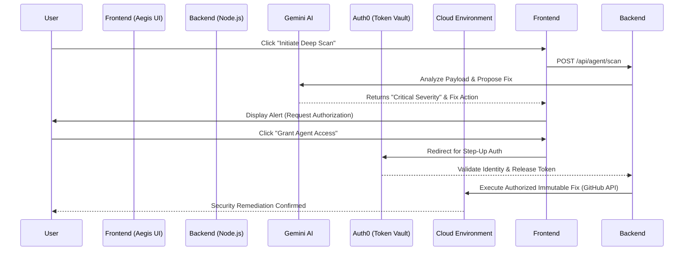

<div align="center">
  
  
  
</div>

<br/>

<div align="center">
  <h1>🛡️ Aegis Sentinel</h1>
  <p><b>An Autonomous Cloud Security Auditor with Zero-Trust Permission Boundaries.</b></p>
  
  [](https://aegis-sentinel.onrender.com)

  [](https://aegis-sentinel.onrender.com)
  <p><i>Live on Render | Built for the "Authorized to Act: Auth0 for AI Agents" Hackathon.</i></p>
  <p><sub><i>Note: Since this is hosted on a free instance, the first load may take 30-60 seconds to spin up.</i></sub></p>
</div>

---

## 🎯 Executive Summary
AI Agents are incredibly powerful, but granting them unchecked, permanent access to infrastructure constitutes a catastrophic security risk. How do we harness the speed of AI remediation without risking catastrophic blast-radius damage?

Enter **Aegis Sentinel**: A premium, autonomous security orchestrator that identifies critical vulnerabilities in cloud environments. Operating under a strict **Zero-Trust paradigm**, Aegis Sentinel can *detect* any vulnerability, but it can *fix* absolutely nothing without explicit human consent. By utilizing the **Auth0 for AI Agents Token Vault**, Aegis Sentinel ensures that high-privilege credentials (like GitHub PATs or AWS Keys) are vaulted by Auth0 and exclusively released to the agent following a Step-Up Authentication challenge.

## 🔑 Hackathon Requirement: The Security Boundary
This project was meticulously designed to demonstrate the core judging criteria of the hackathon:
- **Security Model (40%)**: The Gemini 2.5 Agent operates in a read-only "sandbox". The LLM never sees the raw keys; it only operates through the Auth0 Vault gateway via dynamic scopes.
- **User Control (30%)**: Remediation triggers a strict blocking mechanism. The user must explicitly click "Grant Access", redirecting them to Auth0 to verify their identity. 
- **Technical Execution (30%)**: Securely retrieves the scoped credential specifically deposited by the user to execute a real-world API action (pushing an audit issue to a GitHub repository).

---

## 📐 Architecture / Flow Diagram



## 🧠 Hackathon Architectural Decisions

### Why simulate the AWS Environment?
For this hackathon, we intentionally **mocked the AWS vulnerability targets** (like an exposed S3 bucket or overly permissive IAM roles). Spinning up live vulnerable AWS infrastructure is costly, legally precarious, and distracts from the core goal of the "Authorized to Act" prompt. 

Mute execution is counter-intuitive for demonstrations, so we designed a hybrid approach:
1. The **vulnerability detection** is dynamically simulated.
2. The **Auth0 Token Vault Flow** is architecturally mirrored to demonstrate the secure retrieval sequence without beta SDK overhead.
3. As **proof of real-world execution**, the agent uses the vaulted credentials to execute a *real* GitHub API action. Instead of making an invisible AWS API call, the agent permanently writes its audit findings and attributes it to the Auth0 session user directly into the repository!

---

## 🚀 Features
- **Dynamic Threat Intelligence**: Ingests cloud vulnerability data and leverages `gemini-2.5-flash` to evaluate blast radius and propose immediate remediation.
- **Glassmorphic Enterprise Experience**: Crafted purely in vanilla HTML/CSS to prove that highly secure authentication tools don't have to compromise on visual fidelity or premium UI/UX.
- **Dual-Sync Terminal Auditing**: Real-time visualization of the Agent's internal state machine, logging Step-up authorization sequences for compliance.

## 📂 Project Structure

```text
├── server.js            # Express Server, Gemini AI & Auth0 Logic
├── public/              # Glassmorphic UI & Terminal Assets
│   ├── index.html       # Single-Page Dashboard
│   ├── style.css        # Premium Design Tokens
│   └── app.js           # Frontend Auth & State Management
├── narrative.txt        # Demo Voiceover Script
├── .env.example         # Template for security credentials
└── LICENSE              # MIT Permissive License
```

## 🔍 Key Logic Highlights

- **AI Threat Auditor**: Located in `server.js` (Lines 38 - 79). Uses Gemini 2.5 Flash to dynamically evaluate cloud risks.
- **Zero-Trust Remediation**: Located in `server.js` (Lines 81 - 159). Orchestrates the **Step-Up Authentication** handshake and Token Vault retrieval.

## 🛠️ Local Setup & Configuration

To run Aegis Sentinel locally and test the Token Vault boundary natively:

1. **Clone the repository:**
   ```bash
   git clone https://github.com/ThryLox/aegis-sentinel.git
   cd aegis-sentinel
   npm install
   ```

2. **Configure Environment Variables:**
   Create a `.env` file in the root directory and map the following keys:
   ```env
   GEMINI_API_KEY=your_gemini_key
   GITHUB_TOKEN=your_github_pat
   AUTH0_DOMAIN=your_auth0_domain
   AUTH0_CLIENT_ID=your_auth0_client_id
   AUTH0_CLIENT_SECRET=your_auth0_client_secret
   AUTH0_BASE_URL=http://localhost:3000
   SECRET=your_auth0_express_cookie_secret
   ```

3. **Start the Zero-Trust Environment:**
   ```bash
   npm start
   # or node server.js
   ```

4. Navigate to `http://localhost:3000` to interact with the Sentinel Dashboard. Ensure you configure your Auth0 Application Allowed Callbacks appropriately.

---

<div align="center">
  <p>Engineered securely by <b>ThryLox</b> for the 2026 DevPost Hackathon.</p>
</div>
